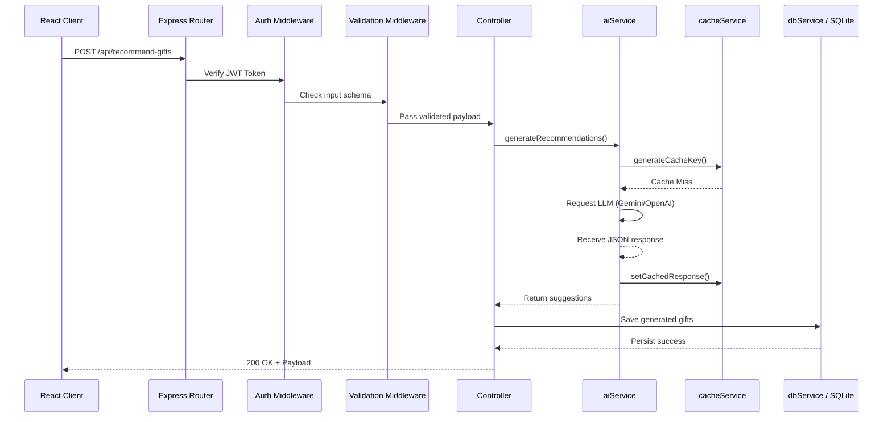

# GiftBro AI Architecture

## Overview

GiftBro AI follows a modular, monolithic architecture using Express.js (Node.js) on the backend and React/Vite on the frontend. The system relies heavily on AI APIs (Gemini/OpenAI) for core business logic, with deterministic caching to optimize latency and cost.

## Request Lifecycle

## Scaling the Database

Currently, GiftBro AI uses `sql.js` for zero-configuration, in-memory SQLite storage that writes back to disk on every mutating transaction (`saveDatabase()`). 

**Scaling Limit:** This approach means the entire database is held in application memory, and concurrent disk writes are not safely isolated for high traffic. 

**Migration Path for Production:**
1. **Short Term:** Swap `sql.js` for `better-sqlite3`. This provides native bindings, file-based WAL (Write-Ahead Logging), and supports concurrent reads/writes without loading the entire dataset into RAM.
2. **Long Term:** Migrate to PostgreSQL. Update `getDatabase()` and `runQuery()` in `database.js` and `dbService.js` to use `pg` or an ORM like Sequelize/Prisma to accommodate horizontal scaling of the backend fleet.
